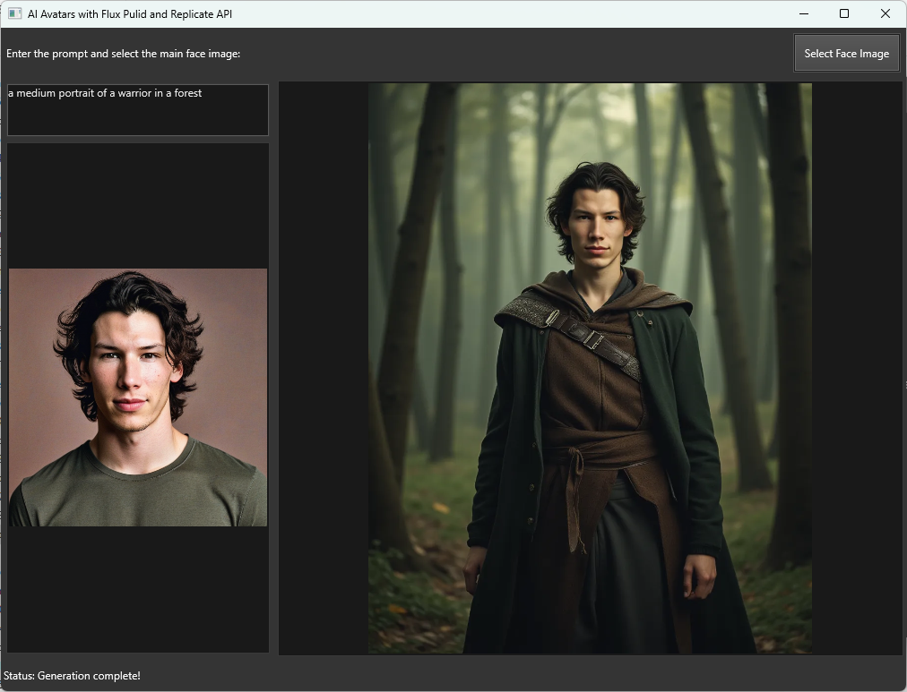

# AI Avatars with Flux Pulid and Replicate API



Welcome to **AI Avatars with Flux Pulid and Replicate API** – a desktop GUI application built with DelphiFMX for Python that creates AI-generated avatars from a user's photo using text prompts. This application leverages the [Flux-PuLID](https://replicate.com/zsxkib/flux-pulid) model on [Replicate API](https://replicate.com/) to bring your avatar ideas to life.

## Features
- Upload a face image to serve as the base for the avatar.
- Enter a text prompt to describe the desired avatar style and scene.
- Generate a unique AI avatar image based on your input and face image.
- Display both the original image and the generated avatar in the GUI.
- Track generation status in real-time.

## Getting Started

### Prerequisites
- Python 3.8 or higher
- An API key from [Replicate](https://replicate.com/account)

### Installation
1. Clone this repository:
   ```bash
   git clone https://github.com/yourusername/ai-avatars-flux-pulid.git
   cd ai-avatars-flux-pulid
   ```

2. Install required packages:
   ```bash
   pip install replicate delphifmx
   ```

3. Set your Replicate API Key:
   In your environment, set the `REPLICATE_API_TOKEN` variable to your Replicate API key.
   ```bash
   export REPLICATE_API_TOKEN="your_replicate_api_key"
   ```

### Running the Application
Execute the following command to start the application:
```bash
python ai-avatars.py
```

## Usage
1. Enter a descriptive prompt in the prompt text box (e.g., "superhero flying above planet Earth").
2. Click the **Select Face Image** button to upload a face image.
3. The app will start generating the avatar based on the uploaded image and prompt.
4. Track the generation progress in the status bar at the bottom of the app.
5. Once the generation is complete, the output image will be displayed on the right side of the app.

## Code Overview

The application is structured with the following primary sections:
- **Initialization**: Sets up the main form and its components.
- **File Upload and Image Display**: Handles the face image upload and displays the image in the GUI.
- **Avatar Generation**: Sends the image and prompt to Replicate's Flux-PuLID model for processing.
- **Status Tracking**: Displays generation progress and outputs the generated avatar upon completion.

### Import Links
- [Replicate API](https://replicate.com/docs/get-started/python)
- [Flux-PuLID Model](https://replicate.com/zsxkib/flux-pulid)

## Dependencies
- [replicate](https://pypi.org/project/replicate/)
- [delphifmx](https://pypi.org/project/delphifmx/)

## License
This project is licensed under the MIT License.

## Contributing
Contributions are welcome! Please fork the repository and submit a pull request.

## Contact
For questions or support, feel free to reach out or create an issue on GitHub.
